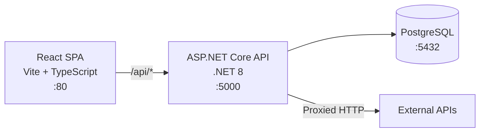
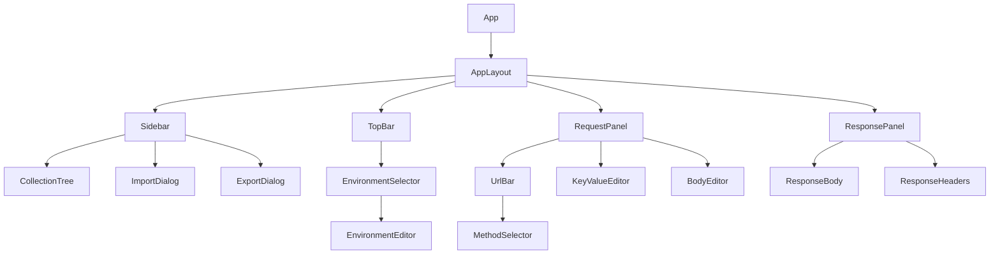
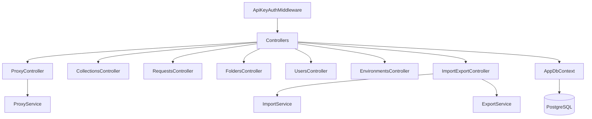
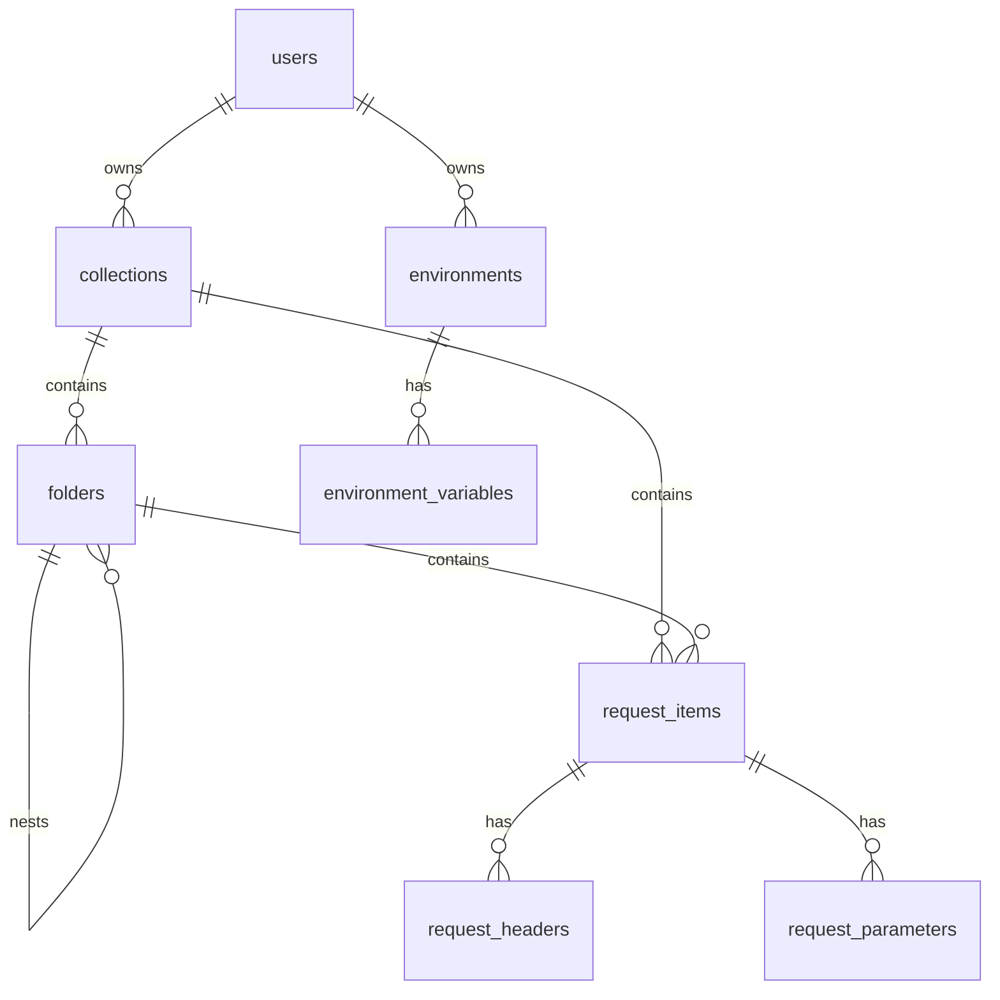
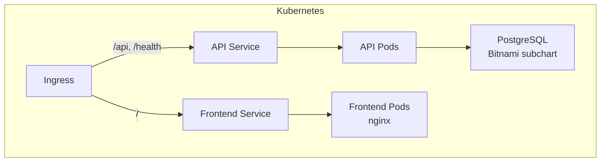

# Restward Architecture

## System Overview

## Component Architecture

### Frontend (React + TypeScript)

**State Management**: Zustand store holds active request, response, collections, environments, and UI state.

**API Client**: Fetch wrapper (`api/client.ts`) attaches `X-Api-Key` header to all requests.

### Backend (ASP.NET Core)

**Authentication**: API key middleware checks `X-Api-Key` header, looks up user in DB, sets `HttpContext.Items["User"]`. Skips `/health` endpoint.

**Proxy Service**: Executes HTTP requests on behalf of users using `IHttpClientFactory`. Returns status, headers, body, and timing.

## Database Schema

## Request Flow

1. User clicks **Send** in the UI
2. Frontend resolves `{{variables}}` from active environment
3. Frontend POSTs to `/api/proxy` with method, URL, headers, body
4. `ApiKeyAuthMiddleware` validates the API key
5. `ProxyService` executes the HTTP request via `HttpClient`
6. Response (status, headers, body, timing) returned to frontend
7. Frontend displays response with syntax highlighting

## Deployment

